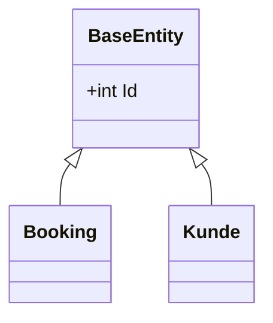
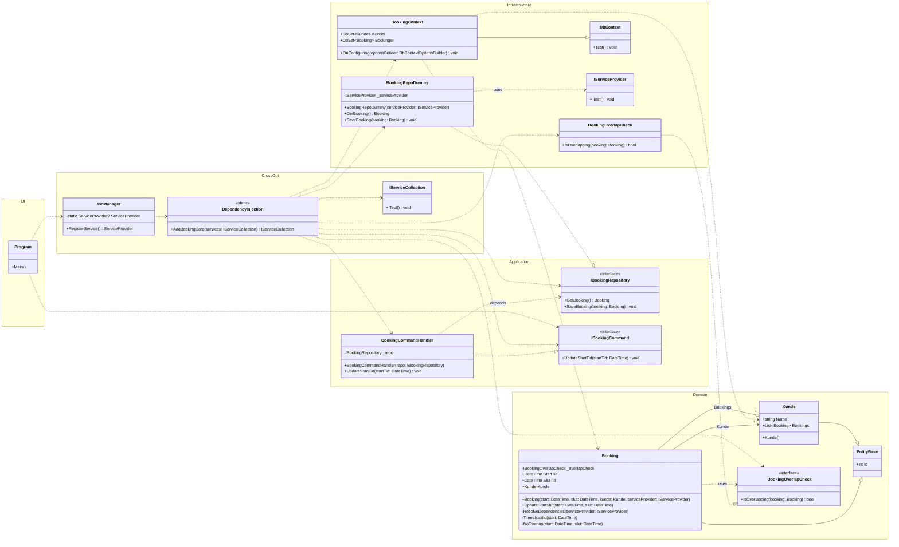

# Anvendelse af Entity Framework i Booking projektet

Vi skal nu i gang med at lægge persistering på Vores booking projekt. Jeg har valgt at vi ser på problemstillingen ud fra de forskellige lag - menlig Domain, Infrastructor, CrossCut, Application og UI


## Domain

Vi starter i "Domain" området. Det der kendetegner en entity er at den har en blivende værdi det vil sige at data i en entity skal jeg kunne genskabes efter program genstart. Det giver udfordringer i forhold til en objektmodel hvor vi jo netop kender objekterne ud fra deres objekt referencer men de er jo en memory i processen opstået i forbindelse med at man opretter objekter. De objekt referencer kan man ikke gemme på disken og genskabe objekterne ud fra. Derfor er man nødt til at tilknytte objekterne en syntetisk identitet. Det gør man typisk ved at tilknyttet et felt i objektet der kaldes ID. Datatypen kan være for eksempel et heltal eller en GUID. For at mindske forstyrrelsen i objekt systemet vælger her at oprette en klasse som jeg kalder entity base. Initiativ base indeholder identiteten og nede af til de konkrete entiteter. Herved opnår vi muligheden for at man kan gemme objekter i en database på baggrund af ID’et og genskabe dem igen og Der er behov for det på baggrund af i ID’et.

Nedenstående er vist et klasse diagram der illustrerer løsningen.





Den konkrete kode er vist nedenstående

```c#
namespace Booking.Domain.Entity;
public class EntityBase
{
    public int Id { get; protected set; }
}
```


```c#
namespace Booking.Domain.Entity;

public class Kunde : EntityBase
{
    public string Name { get; set; }
    public List<Booking> Bookings { get; set; } = new();
}
```


```c#
using Booking.Domain.DomainService;
namespace Booking.Domain.Entity;
public class Booking : EntityBase
{
    private IBookingOverlapCheck _overlapCheck;
    public DateTime StartTid { get; private set; }
    public DateTime SlutTid { get; private set; }
    public Kunde Kunde { get; private set; }

    // EF Only
    protected Booking() { }

    public Booking(DateTime start, DateTime slut, Kunde kunde, IServiceProvider serviceProvider)
    {
        ResolveDependencies(serviceProvider);
        TimesIsValid(start);
        NoOverlap(start, slut);
        if (_overlapCheck.IsOverlapping(this)) throw new Exception("Overlap");

        Kunde = kunde;
        StartTid = start;
        SlutTid = slut;
    }

    private void ResolveDependencies(IServiceProvider serviceProvider)
    {
        _overlapCheck = serviceProvider.GetService(typeof(IBookingOverlapCheck)) as IBookingOverlapCheck ??
                        throw new Exception("Could not resolve IBookingOverlapCheck");
    }

    public void UpdateStartSlut(DateTime start, DateTime slut)
    {
        TimesIsValid(start);
        TimesIsValid(StartTid);
        NoOverlap(start, slut);

        StartTid = start;
        SlutTid = slut;
    }

    private void TimesIsValid(DateTime start)
    {
        if (DateTime.Now > start) throw new Exception("Booking is in the past");
    }

    //En Booking må ikke overlappende andre bookinger.
    private void NoOverlap(DateTime start, DateTime slut)
    {
    }
}
```


Vi ved allerede nu at vi vil anvende entity framework til at gemme og genskabe objekter fra databasen. Det giver nogle udfordringer i forhold til en ren objektmodel. Entity framework har brug for at kunne instantiere objekter uden diverse forretningsregler. Derfor er det nødvendigt at have en default constructor som en framework kan anvende. For at undgå andre bruger denne konstruktør er den sats som protected. Dette er tilstrækkeligt idet entity framework et begreb der hedder refleksion til at skabe objekter og dermed kan omgå en kapsling som for eksempel protected.

"Domain" er nu klar til at blive gemt og genskabt af entity framework 


## Application

Som konsekvens af at vi har tilføjet et id til entiteterne får det konsekvenser for kontrakter og implementering af disse.

Lad os starte med `IBookingRepository`

```c#
namespace Booking.Application;

public interface IBookingRepository
{
    Domain.Entity.Booking GetBooking(int id);
    void SaveBooking(Domain.Entity.Booking booking);
}
```


Og `IBookingCommand` 

```c#
namespace Booking.Application;

public interface IBookingCommand
{
    void UpdateStartTid(int id, DateTime startTid);
}
```

Ændringen i `IBookingCommand` og `IBookingRepository` giver følgende ændring i `BookingCommandHandler`

```c#
namespace Booking.Application;

public class BookingCommandHandler : IBookingCommand
{
    private readonly IBookingRepository _repo;

    public BookingCommandHandler(IBookingRepository repo)
    {
        _repo = repo;
    }

    void IBookingCommand.UpdateStartTid(int id, DateTime startTid)
    {
        // Load
        var booking = _repo.GetBooking(id);

        // Do
        booking.UpdateStartSlut(startTid, booking.SlutTid);

        // Save
        _repo.SaveBooking(booking);
    }
}
```


## Infrastructor

Persistering er et ansvar der hører hjemme i Infrastructor. Derfor skal "Entity Framework tingene" placeres her.

Først skal der tilknyttes de nødvendige Nuget pakker. Nedenstående er vist den tilrettede csproj fil der inkluderer de nødvendige Nuget pakker.

```xml
<Project Sdk="Microsoft.NET.Sdk">

  <PropertyGroup>
    <TargetFramework>net9.0</TargetFramework>
    <ImplicitUsings>enable</ImplicitUsings>
    <Nullable>enable</Nullable>
  </PropertyGroup>

  <ItemGroup>
    <PackageReference Include="Microsoft.EntityFrameworkCore.SqlServer" Version="9.0.8" />
    <PackageReference Include="Microsoft.EntityFrameworkCore.Tools" Version="9.0.8">
      <PrivateAssets>all</PrivateAssets>
      <IncludeAssets>runtime; build; native; contentfiles; analyzers; buildtransitive</IncludeAssets>
    </PackageReference>
  </ItemGroup>

  <ItemGroup>
    <ProjectReference Include="..\Booking.Application\Booking.Application.csproj" />
    <ProjectReference Include="..\Booking.Domain\Booking.Domain.csproj" />
  </ItemGroup>

</Project>
```

### Microsoft.EntityFrameworkCore.SqlServer  

**Microsoft.EntityFrameworkCore.SqlServer** er pakken til databaseudbyderen i **Entity Framework Core (EF Core)**, som bruges til Microsoft SQL Server og Azure SQL-databaser. Den gør det muligt for .NET-udviklere at arbejde med disse databaser ved hjælp af **objekt-relationel mapping (ORM)**, hvor .NET-objekter og LINQ-forespørgsler oversættes til SQL. Det forenkler dataadgang og reducerer behovet for at skrive rå SQL-kode.

#### Hvad den gør:

**Opretter forbindelse til SQL Server:**
Den stiller de nødvendige værktøjer og tjenester til rådighed for at etablere en forbindelse fra din .NET-applikation til en SQL Server- eller Azure SQL-database.

**Objekt-relationel mapping (ORM):**
Den muliggør mapping af dine C#-klasser (entiteter) til databasetabeller og deres egenskaber til kolonner, så du kan arbejde med data som almindelige .NET-objekter.

**Forenkler dataadgang:**
Udviklere kan bruge LINQ-forespørgsler til at hente og manipulere data, som udbyderen derefter konverterer til de relevante SQL-kommandoer.

**Understøtter nøglefunktioner:**
Den håndterer opgaver som forbindelsespuljer (connection pooling), genforsøg (retries), logning og andre database-relaterede operationer.


### Microsoft.EntityFrameworkCore.Tools
**Microsoft.EntityFrameworkCore.Tools** er en hjælpepakke til **Entity Framework Core (EF Core)**, som giver udviklere adgang til en række kommandolinjeværktøjer, der understøtter udvikling og vedligeholdelse af EF Core-baserede applikationer.

#### Hvad den gør:

**Migrationer og databaseopdatering:**
Den gør det muligt at oprette, opdatere og administrere **migrationer**, som er EF Cores måde at holde styr på ændringer i datamodellen og synkronisere dem med databasen.

**Kommandolinjeværktøjer:**
Pakken giver adgang til kommandoer som `dotnet ef migrations add`, `dotnet ef database update` og `dotnet ef dbcontext scaffold`, som bruges til at:

- Tilføje nye migrationer baseret på ændringer i dine C#-modeller.
- Opdatere databasen til den nyeste model.
- Generere C#-modeller ud fra en eksisterende database (reverse engineering).

**Integration med udviklingsværktøjer:**
Den bruges ofte sammen med Visual Studio eller kommandolinjen og er essentiel for udviklere, der arbejder med EF Core i .NET-projekter.

**Automatiserer databasearbejde:**
Ved at bruge værktøjerne kan udviklere undgå manuel SQL og i stedet lade EF Core generere og køre de nødvendige scripts.


### Database context

I Entity Framework er "database context" en helt central klasse. I vores kode skal vi lave en nedarvning fra Entity Framework klassen DbContext.

Den konkrete kode er vist nedenstående.

```c#
using Microsoft.EntityFrameworkCore;
using Entity = Booking.Domain.Entity;

namespace Booking.Infrastructor.Database;

public class BookingContext : DbContext
{
    public static readonly string ConnectionString =
        "Server=localhost;" +
        "Database=BookingDb;" +
        "Trusted_Connection=True;" +
        "MultipleActiveResultSets=true;" +
        "TrustServerCertificate=True";

    protected override void OnConfiguring(DbContextOptionsBuilder optionsBuilder)
    {
        optionsBuilder.UseSqlServer(ConnectionString);
    }

    // Define DbSets for your entities here
    public DbSet<Entity.Kunde> Kunder { get; set; }
    public DbSet<Entity.Booking> Bookinger { get; set; }
}
```

Der er forskellige interessante elementer i koden som vi vil se på nu

```c#
public class BookingContext : DbContext
```


#### DbContext

Hvad er `DbContext` ?

**DbContext** er en central klasse i **Entity Framework Core (EF Core)**, som fungerer som broen mellem din .NET-applikation og databasen. Den styrer dataadgang, konfiguration og interaktion med databasen via objekt-relationel mapping (ORM).

##### Hvad den gør:

**Administrerer databaseforbindelsen:**
DbContext opretter og håndterer forbindelsen til databasen, så du kan læse og skrive data uden at skulle håndtere SQL direkte.

**Sporer ændringer i objekter:**
Den holder styr på ændringer i dine C#-objekter (entiteter), så EF Core ved, hvilke data der skal opdateres i databasen, når du kalder `SaveChanges()`.

**Udfører forespørgsler og kommandoer:**
Du kan bruge LINQ til at skrive forespørgsler mod databasen, og DbContext sørger for at oversætte dem til SQL og returnere resultaterne som .NET-objekter.

**Konfigurerer datamodellen:**
Via metoden `OnModelCreating` kan du definere, hvordan dine entiteter skal mappes til databasen – f.eks. navne på tabeller, relationer og constraints.

**Understøtter migrationer og databaseinitialisering:**
DbContext bruges som udgangspunkt for EF Core’s migrationssystem, som holder databasen opdateret i forhold til dine C#-modeller.

#### ConnectionString

```c#
    public static readonly string ConnectionString =
        "Server=localhost;" +
        "Database=BookingDb;" +
        "Trusted_Connection=True;" +
        "MultipleActiveResultSets=true;" +
        "TrustServerCertificate=True";
```

I variablen `ConnectionString` ligger de nødvendige parmetre for at kunne kommunikerer med databasen. For eksempel hvilken SQL server der hoster databasen, database navnet på SQL serveren, login oplysninger samt nogle tekniske parametre som "bare skal være sådan".

 

#### OnConfiguring

```c#
    protected override void OnConfiguring(DbContextOptionsBuilder optionsBuilder)
    {
        optionsBuilder.UseSqlServer(ConnectionString);
    }
```
Da vores projekt indtil videre skal bruges af en `ConsoleApp` som UI er der nogle begrænsninger i forhold til b.la. `Blazor`. Men en ConsoleApp kan man ikke constructor injecte connection informationen. Her er man nød til at anvende `OnConfiguring` til at håndterer konfiguration af forbindelsen til databasen.

Anvender man ASP.NET Core (herunder Blazor) anvende constructor injection som vist nedenstående

```c#
public class BookMyHomeContext : DbContext
{
    public BookMyHomeContext(DbContextOptions<BookMyHomeContext> options) : base(options)
    {
    }
```

Men som sagt. Det kan man ikke med en `ConsoleApp`.

#### DbSet

```c#
    // Define DbSets for your entities here
    public DbSet<Entity.Kunde> Kunder { get; set; }
    public DbSet<Entity.Booking> Bookinger { get; set; }
```


**DbSet** er en klasse i **Entity Framework Core (EF Core)**, som repræsenterer en samling af entiteter (C#-objekter), der kan læses fra og skrives til en database. Den bruges typisk som en egenskab i din `DbContext` og fungerer som en "virtuel tabel", hvor du kan udføre forespørgsler og ændringer.

##### Hvad den gør:

**Repræsenterer en tabel i databasen:**
Hver `DbSet<TEntity>` svarer til en tabel i databasen, hvor `TEntity` er den C#-klasse, der repræsenterer en række (record) i tabellen.

**Muliggør forespørgsler med LINQ:**
Du kan skrive LINQ-forespørgsler direkte mod en `DbSet`, f.eks. `context.Students.Where(s => s.Age > 18)`, og EF Core oversætter det til SQL.

**Understøtter CRUD-operationer:**
Du kan bruge metoder som `Add`, `Remove`, `Update` og `Find` på en `DbSet` for at oprette, slette, opdatere eller hente data.

**Samarbejder med DbContext:**
Når du kalder `SaveChanges()` på din `DbContext`, gemmes ændringerne i alle tilknyttede `DbSet`-instanser i databasen.


### Ændringer i repository og Domain services

Vi kan nu droppe `BookingRepoDummy` og oprette en "rigtig" repository klasse.

```c#
using Booking.Application;
using Booking.Infrastructor.Database;

namespace Booking.Infrastructor;

public class BookingRepository : IBookingRepository
{
    private readonly BookingContext _db;

    public BookingRepository(BookingContext db)
    {
        _db = db;
    }

    Domain.Entity.Booking IBookingRepository.GetBooking(int id)
    {
        return _db.Bookinger.Find(id) ?? throw new Exception("Booking not found");
    }

    void IBookingRepository.SaveBooking(Domain.Entity.Booking booking)
    {
        _db.SaveChanges();
    }
}
```


Og... `BookingOverlapCheck` kan nu implementeres

```c#
using Booking.Domain.DomainService;
using Booking.Infrastructor.Database;
using Microsoft.EntityFrameworkCore;

namespace Booking.Infrastructor;

public class BookingOverlapCheck : IBookingOverlapCheck
{
    private readonly BookingContext _db;

    public BookingOverlapCheck(BookingContext db)
    {
        _db = db;
    }

    bool IBookingOverlapCheck.IsOverlapping(Domain.Entity.Booking booking)
    {
        // Guard: if no customer, we cannot determine overlap (treat as no overlap)
        if (booking.Kunde is null) return false;

        // NOTE: Definition:
        // Intervals [A.Start, A.End) and [B.Start, B.End) overlap if:
        // A.Start < B.End AND A.End > B.Start
        // If you want "touching" (end == start) to count as overlap, change < / > to <= / >=.

        var kundeId = booking.Kunde.Id;

        return _db.Bookinger
            .AsNoTracking()
            .Where(b => b.Id != booking.Id) // exclude same booking (updates)
            .Where(b => b.Kunde.Id == kundeId) // same customer
            .Any(b =>
                b.StartTid < booking.SlutTid && // overlaps on left
                b.SlutTid > booking.StartTid); // overlaps on right
    }
}
```


 ## CrossCut

Vores IoC rodpunkt ligger i CrossCut komponenten. Derfor er der også her ændringer for at understøtte Entity Framework.

Først og fremmest har jeg valgt at re-factor `IocManager` således det at oprette en IoC container adskilles fra det at udfylde IoC containeren. Derfor er det at udfylde IoC containeren flyttet til en "Extension metode" kaldet `AddBookingCore`. Den tilrettede `IocManager` er vist nedenstående

```c#
using Microsoft.Extensions.DependencyInjection;

namespace Booking.CrossCut;

public class IocManager
{
    private static ServiceProvider? ServiceProvider;

    public static ServiceProvider RegisterService()
    {
        if (ServiceProvider is not null) return ServiceProvider;
        var serviceProvider = new ServiceCollection()
            .AddBookingCore()
            .BuildServiceProvider();

        ServiceProvider = serviceProvider;
        return ServiceProvider;
    }
}
```


**`AddBookingCore`** er den interessante ændring. Her er koden:

```c#
using Booking.Application;
using Booking.Domain.DomainService;
using Booking.Infrastructor;
using Booking.Infrastructor.Database;
using Microsoft.Extensions.DependencyInjection;

namespace Booking.CrossCut;

public static class DependencyInjection
{
    public static IServiceCollection AddBookingCore(this IServiceCollection services)
    {
        services.AddScoped<IBookingCommand, BookingCommandHandler>();
        services.AddScoped<IBookingRepository, BookingRepository>();
        services.AddScoped<IBookingOverlapCheck, BookingOverlapCheck>();

        services.AddDbContext<BookingContext>();
        return services;
    }
}
```

Det nye er `services.AddDbContext<BookingContext>();` 

**`AddDbContext`** er en metode, der bruges i .NET’s Dependency Injection til at registrere en `DbContext`-klasse i applikationens servicecontainer. Det gør det muligt for .NET at oprette og administrere instanser af din `DbContext`, når de skal bruges i f.eks. controllere, services eller repositories.

Metoden **`AddDbContext`** kommer fra NuGet-pakken: `Microsoft.EntityFrameworkCore`.


## UI

I `ConsoleApp` er der også en ændring som ikke har noget med applikationen at gøre. Det er nemlig nødvendigt at referer til Nuget pakken `Microsoft.EntityFrameworkCore.Design`. Dette er nødvendigt for at kunne bruge Entity Frame værktøjerne til at oprette databaser (Add-Migration og Update-Database).

Den nye csproj fil er:

```xml
<Project Sdk="Microsoft.NET.Sdk">

  <PropertyGroup>
    <OutputType>Exe</OutputType>
    <TargetFramework>net9.0</TargetFramework>
    <ImplicitUsings>enable</ImplicitUsings>
    <Nullable>enable</Nullable>
  </PropertyGroup>

  <ItemGroup>
    <PackageReference Include="Microsoft.EntityFrameworkCore.Design" Version="9.0.8">
      <PrivateAssets>all</PrivateAssets>
      <IncludeAssets>runtime; build; native; contentfiles; analyzers; buildtransitive</IncludeAssets>
    </PackageReference>
  </ItemGroup>

  <ItemGroup>
    <ProjectReference Include="..\Booking.Application\Booking.Application.csproj" />
    <ProjectReference Include="..\Booking.CrossCut\Booking.CrossCut.csproj" />
  </ItemGroup>

</Project>
```

### Microsoft.EntityFrameworkCore.Design
**Microsoft.EntityFrameworkCore.Design** er en NuGet-pakke til **Entity Framework Core (EF Core)**, som indeholder værktøjer og funktioner, der bruges under udvikling – især i forbindelse med **migrationer**, **scaffolding** og **design-tidstjenester**.

#### Hvad den gør:

**Understøtter design-tidsfunktioner:**
Pakken gør det muligt for EF Core at udføre visse operationer under designfasen af en applikation – f.eks. generering af migrationsfiler og reverse engineering af databaser.

**Krævet for EF Core CLI-kommandoer:**
Hvis du bruger EF Core via kommandolinjen (`dotnet ef`), skal denne pakke være installeret for at kommandoer som `migrations add`, `database update` og `dbcontext scaffold` kan fungere.

**Indeholder design-tidstjenester:**
Disse tjenester bruges af værktøjer som Visual Studio og `dotnet ef` til at analysere din `DbContext`, generere SQL-scripts og oprette C#-klasser ud fra en eksisterende database.


### UI program

Pga. ændringen i `IBookingCommand` ændres UI koden også:

```c#
// See https://aka.ms/new-console-template for more information

using Booking.Application;
using Booking.CrossCut;

Console.WriteLine("Hello, World!");

var serviceProvider = IocManager.RegisterService();
var bookingCommand = serviceProvider.GetService(typeof(IBookingCommand)) as IBookingCommand;

bookingCommand.UpdateStartTid(1, DateTime.Now
                                    + new TimeSpan(0, 0, 30, 0));

Console.WriteLine("Done");
```

Og... En lille omlægning til generics:

```c#
// See https://aka.ms/new-console-template for more information

using Booking.Application;
using Booking.CrossCut;
using Microsoft.Extensions.DependencyInjection;

Console.WriteLine("Hello, World!");

var serviceProvider = IocManager.RegisterService();
var bookingCommand = serviceProvider.GetService<IBookingCommand>();

bookingCommand.UpdateStartTid(1, DateTime.Now
                                    + new TimeSpan(0, 0, 30, 0));

Console.WriteLine("Done");
```


## The Big Picture



